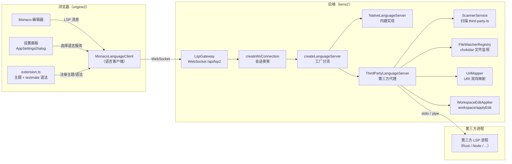
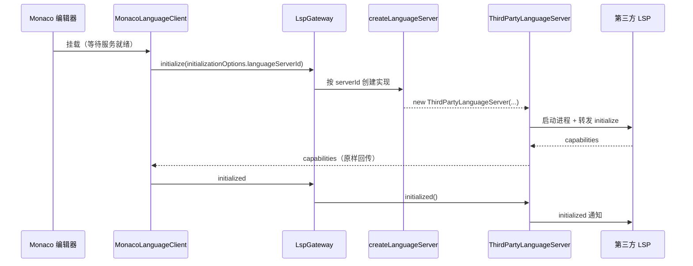
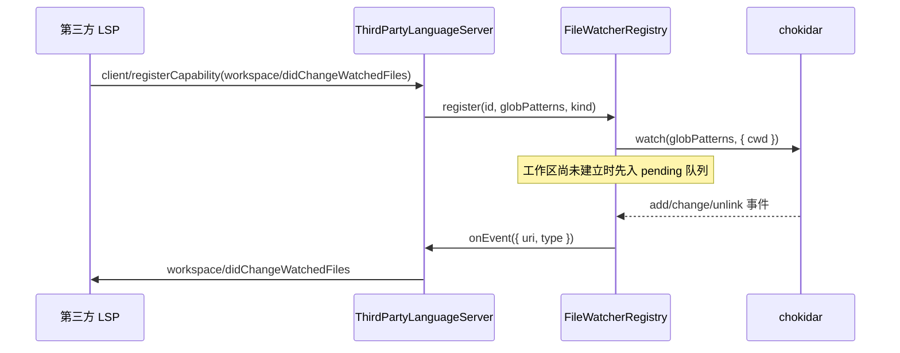

# 语言服务器（LSP）模块

本目录实现 WebGAL Terre 脚本编辑器的语言服务：既包含 WebGAL 内建的语言服务器
（补全、诊断、语义高亮），也包含把协议转发给**第三方语言服务器**的代理层。

## 1. 总体架构

系统分成两层，通过一条 WebSocket（`/api/lsp2`）承载 LSP 协议：

- **前端（packages/origine2）**：Monaco 编辑器 + 一个 `MonacoLanguageClient`。
- **后端（packages/terre2）**：WebSocket 网关，把每个连接桥接到「内建实现」或
  「第三方 LSP 进程」之一。



## 2. 组件职责

### 前端

| 文件 | 职责 |
| --- | --- |
| `webgalscript/lsp.ts` | 初始化 vscode 服务（主题、textmate、配置）；创建并管理 `MonacoLanguageClient`；封装 `scanLanguageServers` / `setActiveLanguageServer` 等控制请求。 |
| `webgalscript/extension.ts` | 通过 `registerExtension` 注册 WebGAL 的主题（`WebGAL Black/White`）与 `source.webgal` 语法。 |
| `pages/editor/TextEditor/TextEditor.tsx` | 渲染 Monaco 编辑器，并在服务就绪后才挂载（避免主题/高亮竞态）。 |
| `components/AppSettings/AppSettingsDialog.tsx` | 语言服务选择菜单（`Dropdown`）。 |

### 后端

| 文件 | 职责 |
| --- | --- |
| `gateway.ts` | NestJS WebSocket 网关，把原生 `ws` 连接包装成 LSP 的 reader/writer。 |
| `webgalLsp.ts` | 每个连接一条 LSP 会话：解析 `initializationOptions.languageServerId`，创建对应实现，处理 initialize/initialized/shutdown/exit。 |
| `languageServerFactory.ts` | 根据 `serverId` 分流：`native` → 内建，其它 → 第三方代理。 |
| `types.ts` | `LanguageServer` 接口与 `LanguageServerMode`。 |
| `baseLanguageServer.ts` | 抽象基类：持有连接/文档集合/扫描器，统一注册控制请求（`textDocument/setBasePath`、`$/scanLanguageServers`、`$/getActiveLanguageServer`、`$/setActiveLanguageServer`）。 |
| `nativeLanguageServer.ts` | 内建实现：补全、诊断、语义高亮。 |
| `thirdPartyLanguageServer.ts` | 第三方代理：把除控制请求外的所有请求/通知转发给第三方 LSP，并代理文件监视、`workspace/fs`、`workspace/applyEdit`、诊断回传。 |
| `uriMapper.ts` | 客户端 URI 与 `file://` URI 的双向映射。 |
| `fileWatcherRegistry.ts` | 维护第三方 LSP 通过 `client/registerCapability` 注册的文件监视器（后端用 chokidar 代理）。 |
| `workspaceEdit.ts` | 把 `workspace/applyEdit` 落到文件系统，并把文档变化回传客户端。 |
| `third-party/scanner.service.ts` | 扫描 `~/.webgal_terre/third-party-ls/<id>/start.js` 并加载 launcher。 |
| `third-party/types.ts` | `LspLauncher` 契约。 |

## 3. 关键数据流

### 3.1 初始化与切换



切换语言服务时，前端保存选择后直接 `window.location.reload()`，用全新连接
重新走一遍上面的流程，避免复杂重连状态。

### 3.2 文件监视（didChangeWatchedFiles）

浏览器无法直接监视文件系统，因此由后端代理：



### 3.3 请求转发与 URI 映射

第三方模式下，所有非控制类请求都走「星号 handler」转发给第三方 LSP。转发前
`UriMapper.toFileUri` 把客户端 URI（如 `games/demo/game/scene.txt`）转换为
`file://` 绝对路径；第三方回传的诊断等再经 `toClientUri` 还原。

## 4. 第三方 LSP 接入契约

在 `~/.webgal_terre/third-party-ls/<服务器名称>/start.js` 放置启动脚本，导出：

```ts
interface LspLauncher {
  /** 可选的展示名称；缺省时使用服务器目录名。 */
  name?: string;
  start(): Promise<{ reader: MessageReader; writer: MessageWriter }>;
  stop?(): Promise<void>;
}
```

`start()` 返回一对 LSP 消息 reader/writer（stdio、pipe、socket 均可），其余
协议细节由代理层处理。
